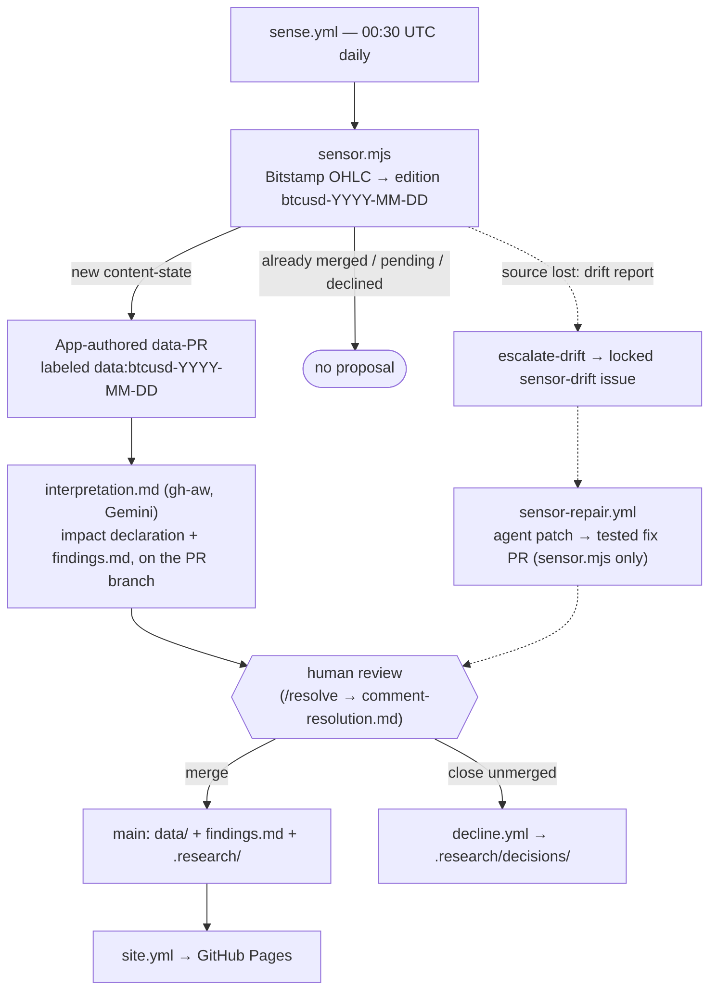

# Continuous Research — Sample Instance

The reference instance for the
[Continuous Research](https://github.com/norabble/continuous-research) framework
— a real demonstrator we control end to end.

> **⚠️ This is a demonstration, not research.** This repo exists only to exercise
> the framework's loop (sense → propose → interpret → review → publish). The
> BTC-USD figures and "trend" claims are **illustrative of the mechanism**, not
> financial analysis, advice, or anything held to a research standard. Don't
> rely on them.

**Subject:** a 24/7 crypto pair (BTC-USD), periodized into **daily editions**
(descriptor `btcusd-YYYY-MM-DD`), with a simple updating trend claim.

## What this repo demonstrates

The smallest *real* instance of the framework: a live data source, a daily
sensing loop, agent-written interpretation, human merge authority, and a
public read-only site — with every mechanism (including a source outage and
its agent-authored repair) legible in the repo's own history. If you want to
see what "research as a living, version-controlled artifact" means in
practice, watch this repo's pull requests for a week.

## Status — live loop

The sensor ([`sensor.mjs`](./sensor.mjs)) fetches real Bitstamp daily OHLC
and builds each day's edition (close, 7-day moving average, trend). The
source adapter lives in `sensor.mjs`; the parts a replacement source must
not change — edition math, source firewall, drift reporting — live in
[`sensor-lib.mjs`](./sensor-lib.mjs) and are covered by `node --test`. The
original deterministic skeleton survives as a test mode: set
`SAMPLE_DESCRIPTOR` and the sensor emits that edition with no network.

The engine is consumed as a SHA-pinned dependency
(`npx github:norabble/continuous-research#<sha>`, currently v0.1.6); hooks
are declared in [`.research/config.json`](./.research/config.json).

## The daily loop

*The everyday path runs top to bottom; the dotted branch is what happens
when the source disappears.*

1. **Sense** (00:30 UTC, [`sense.yml`](./.github/workflows/sense.yml)): the
   engine runs the sensor, dedups the observed edition against merged /
   pending / declined history, and — when it is genuinely new — opens an
   **App-authored data-PR** labeled `data:btcusd-YYYY-MM-DD`, carrying the
   edition artifact and its provenance stub.
2. **Interpret** ([`interpretation.md`](./.github/workflows/interpretation.md),
   a [gh-aw](https://github.com/github/gh-aw) workflow running
   `gemini-3.1-flash-lite` read-only): writes the **impact declaration**
   (`.research/impact/<descriptor>.md` — strengthened / weakened /
   overturned) and revises the living claim in [`findings.md`](./findings.md)
   on the PR branch, through sanitized `safe-outputs` limited to exactly
   those two paths.
3. **Review**: a human merges the data-PR — or closes it unmerged, in which
   case [`decline.yml`](./.github/workflows/decline.yml) records the reason
   in `.research/decisions/<descriptor>.md`, and that content-state can
   never re-propose. A reviewer can also ask for changes with
   `/resolve <request>` (handled by `comment-resolution.md`, same file
   contract).
4. **Publish** ([`site.yml`](./.github/workflows/site.yml)): the read-only
   site rebuilds on data-PR events, findings pushes, and a daily 02:00 UTC
   cron — live at
   **<https://norabble.github.io/continuous-research-sample/>**.

## Where things live

| Artifact                    | Path                                    |
| --------------------------- | --------------------------------------- |
| Living findings (the prose) | [`findings.md`](./findings.md)          |
| Edition data                | `data/btcusd/<descriptor>.json`         |
| Provenance stubs            | `.research/provenance/`                 |
| Impact declarations         | `.research/impact/` (+ data-PR history) |
| Decline records             | `.research/decisions/`                  |
| Live site                   | [norabble.github.io/continuous-research-sample](https://norabble.github.io/continuous-research-sample/) |

## Workflows

| Workflow                | Trigger                                    | What runs                                                        | Layer                        |
| ----------------------- | ------------------------------------------ | ---------------------------------------------------------------- | ---------------------------- |
| `sense.yml`             | daily 00:30 UTC / dispatch                 | sensor → dedup → App-authored data-PR; then `escalate-drift`     | engine (deterministic)       |
| `decline.yml`           | data-PR closed unmerged                    | commit the decline record to `main`                              | engine (deterministic)       |
| `site.yml`              | data-PR events / findings pushes / 02:00   | build the read-only site → GitHub Pages                          | engine (deterministic)       |
| `test.yml`              | PRs touching `sensor*.mjs` / `scripts/**`  | `node --test`                                                    | checks                       |
| `simulate-drift.yml`    | manual dispatch                            | firewall the sensor's current source host (the drift-demo lever) | demo helper                  |
| `interpretation.md`     | a new data-PR                              | impact declaration + findings revision on the PR branch          | agent (gh-aw, Gemini)        |
| `comment-resolution.md` | `/resolve <request>` on a data-PR          | address the reviewer's request, same file contract               | agent (gh-aw, Gemini)        |
| `sensor-repair.yml`     | `sensor-drift` issue / dispatch            | two-job repair: Claude agent proposes a patch artifact; a deterministic ship job re-tests and opens the PR | agent (claude-code-action)   |

## Drift & self-repair

Sources move; the loop is built to notice and recover. The demo lever:
**Actions → simulate-drift → Run workflow** adds the sensor's current source
host to `.research/source-firewall.json` (FIFO, max 2 — old providers become
eligible again). On the next `sense` run the sensor writes a drift report
instead of crashing — firewalled, unreachable, and shape-changed sources all
take this path — and the engine's `escalate-drift` step files (or refreshes)
the single **locked `sensor-drift` issue**.

That issue triggers [`sensor-repair.yml`](./.github/workflows/sensor-repair.yml):
a Claude Code agent (running on a subscription OAuth token, not API billing)
researches a replacement source, verifies it by fetching it, and proposes a
patch touching `sensor.mjs` only — which a deterministic second job
re-applies, re-tests, and opens as a PR under a downscoped App token, so the
agent never holds write scope. Tests gate the PR; a human merges; the next
`sense` run heals and closes the issue.

**This cycle has run for real once already**: the original Coinbase source
was retired behind the firewall, the drift issue fired, and the repair agent
re-pointed the sensor at Bitstamp
([PR #18](https://github.com/norabble/continuous-research-sample/pull/18)).
The whole break → detect → issue → code-fix PR → merge → heal arc is in the
history.

## Adopting the pattern

To build an instance like this around your own subject:

- **[Adoption guide](https://github.com/norabble/continuous-research/blob/main/docs/adopting.md)**
  — from zero to a live loop (hooks, GitHub App, agent layer, first run).
- **[`CONCEPT.md` § Canonical terms](https://github.com/norabble/continuous-research/blob/main/CONCEPT.md#canonical-terms)**
  — the vocabulary used above: descriptor, edition, data-PR, impact
  declaration, provenance stub, decline record.
